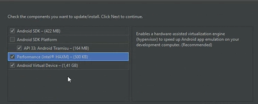
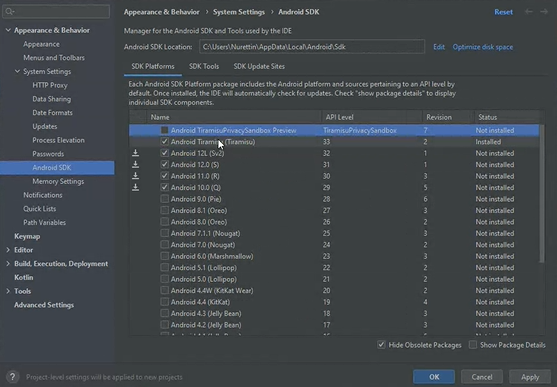
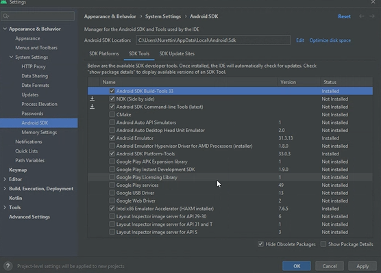
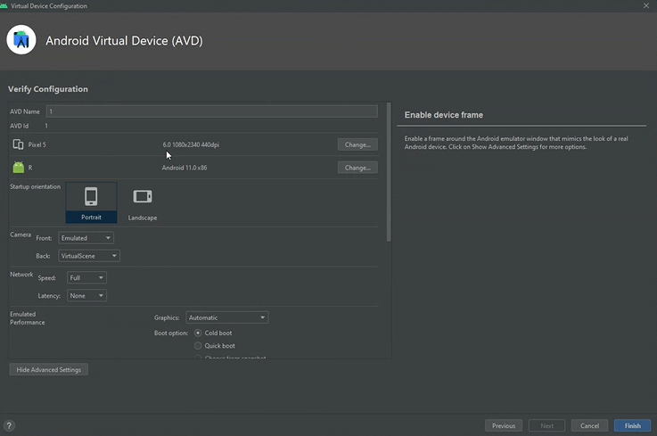
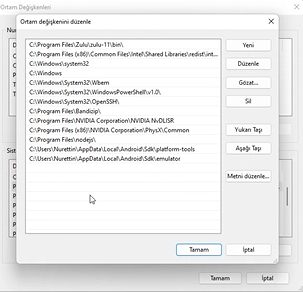

- Visual Studio Code : https://code.visualstudio.com/
- Java'yı yönetmek için tool (Jenv) : https://www.jenv.be/
- Windows için Jenv : https://github.com/FelixSelter/JEnv-for-Windows
- Zulu (Java SDK) : https://www.azul.com/downloads/?package=jdk
- Node.js kurulumu : https://nodejs.org/en/
- Android Studio : https://developer.android.com/studio
- Xcode : https://developer.apple.com/xcode/
   
  <b>Kurulum sırasında dikkat edilmesi gereken şeyler:</b>
- Xcode kısmında eski sürümler : https://stackoverflow.com/questions/10335747/how-to-download-xcode-dmg-or-xip-file
- Java SDK kurulumu kısmında add to path dememiz şart. Eğer yapmadan geçerseniz path kısmına ekstra olarak tanımlayın ya da indirdiğimiz SDK dosyasını tekrar açıp change kısmını seçip add to path kısmını seçerek ekleyin.
- Android kurulumu sırasında tüm tikleri işaretleyiniz.
   
  
   

- Android Studio kurulduktan sonra more actions kısmına tıklayalım ve aşağıda olan kısımları seçelim:
   

  
  

- More Actions -> Virtual Device Manager -> Create Virtual Device kısmından istediğimiz cihazı seçiniz.
- Android Virtual Device kurulumundan sonra Cool boost özelliğini eğer performans istiyorsanız seçiniz. Ram kısmını da ayarlayabilirsiniz.

## React Native CLI ile proje oluşturmak

Proje oluşturmak için `npx react-native init [proje adı]` komutu ile terminale komut yazabilirsiniz.

- Android kısmı için Windows tuşu + R tuşlaması yaparak `SystemPropertiesAdvanced.exe` girin ve ortam değişkenlerini açın.

- Ortam değişkenleri içerisine Sistem değişkenleri kısmından Path kısmına gelip fotoğraftaki son iki kısmı değişkenlere ayrı ayrı ekleyin.

### Mac için:

- Brew yüklemek için : https://brew.sh/index_tr
- `brew install node` diyerek node'u kurunuz.
- Pods için : https://cocoapods.org/
